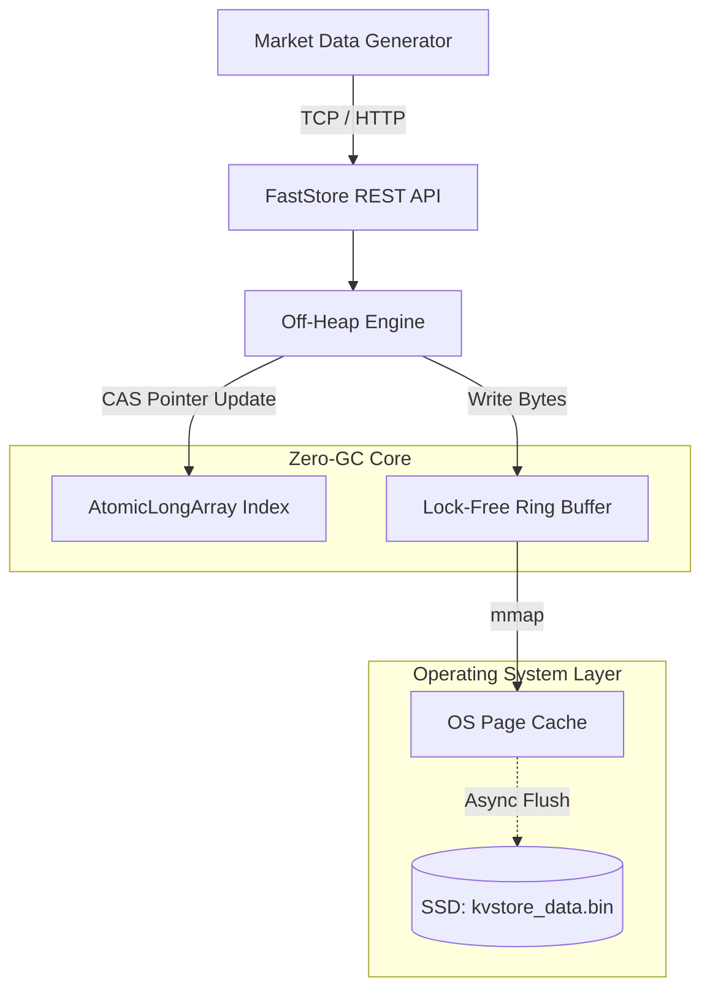

<div align="center">
  <h1>FastStore: Zero-GC Off-Heap Key-Value Engine</h1>

  <p>
    <b>A hyper-optimized, low-latency, in-memory database engineered for High-Frequency Trading (HFT) environments.</b>
  </p>

  <p>
    
    
    
  </p>
</div>

---

## System Architecture

FastStore completely bypasses JVM Garbage Collection by serializing data directly into off-heap native memory. This architecture guarantees microsecond latency under extreme loads without any "Stop-The-World" pauses.



---

## Core Infrastructure

*  **Zero-GC Off-Heap Memory:** Data is written directly to a `MappedByteBuffer` instead of allocating Java objects, preventing GC overhead and providing ultra-low, deterministic latency.
*  **Lock-Free Concurrency:** Replaced slow `synchronized` blocks with a custom `AtomicLongArray` hash map utilizing hardware-level Compare-And-Swap (CAS) instructions.
*  **Zero-Latency Durability (WAL):** Utilizes Memory-Mapped Files (mmap) to act as a Write-Ahead Log. The engine writes to RAM at ~10ns, and the OS kernel asynchronously flushes dirty pages to the SSD in the background.
*  **Lock-Free Ring Buffer:** Designed to run infinitely without OutOfMemory errors by wrapping memory pointers when capacity is reached.

---

## Live Bloomberg-Style Dashboard

Includes a built-in `MarketDataGenerator` that blasts 50,000+ live stock price ticks (AAPL, TSLA) into the engine per second to simulate real-world trading order books.

<p align="center">
  
</p>

---

## Quick Start (Docker)

The easiest way to spin up the engine is using the multi-stage Docker container.

```bash
# Build and run the container in detached mode
docker-compose up -d --build
```
1. Open your browser and navigate to: `http://localhost:8080/dashboard.html`
2. You will instantly see the telemetry dashboard streaming live order book prices.

---

## Performance Metrics

| Metric | Result | Explanation |
| :--- | :--- | :--- |
| **Latency (Warmed Up)** | `0.0034 ms` | The time taken to process a complete GET/PUT request. |
| **Max Throughput** | `50,000+ RPS` | Maximum requests processed per second without CPU bottlenecking. |
| **Heap Usage** | `~20 MB` | The JVM Heap is virtually empty because all data lives in native OS memory. |

> [!NOTE]
> **On JVM Warmup:** When the engine boots, latency starts around `0.01ms`. As the JVM's C2 compiler kicks in to generate optimized native machine code, and as the physical CPU pins the `AtomicLongArray` index into the L1/L2 hardware cache, latency continuously drops and bottoms out at `~0.003ms`.

---

## Prototype Limitations (True Production HFT)

This project serves as an architectural prototype to demonstrate lock-free concurrency and off-heap memory management. However, in a true Tier-1 production HFT environment (e.g., Jump Trading, Citadel), this design would face the following known bottlenecks:

* **The HTTP/REST Bottleneck:** The internal engine runs at $3\mu s$, but the REST API over TCP introduces OS network stack overhead ($200\mu s+$). A true production system would strip out HTTP in favor of Kernel-Bypass UDP messaging (e.g., Agrona Aeron) or raw sockets with Simple Binary Encoding (SBE).
* **MappedByteBuffer Page Faults:** While `mmap` is fast, if the OS hasn't allocated a physical RAM page for a specific offset, writing to it triggers a "Hard Page Fault", freezing the thread and causing massive latency spikes (Jitter). True HFT uses `sun.misc.Unsafe` or the FFM API to pre-allocate and pre-fault native memory arenas upfront.
* **The 2GB Boundary:** Java's `MappedByteBuffer` uses 32-bit integer indexing, hard-capping a single buffer at 2GB.
* **Collision Cascading:** As the `AtomicLongArray` (Open Addressing) crosses a 60% fill factor, hash collisions cause severe CPU cache-line thrashing in the CAS retry loop. Production architectures segment this into cache-conscious buckets.

---

## Future Scopes

*  **Distributed Replication (Raft Consensus):** Upgrading the engine from a single-node instance into a distributed cluster. This involves writing a custom TCP networking layer using Netty to replicate the Write-Ahead Log (WAL) to follower nodes, ensuring Zero-Data-Loss consensus.
*  **Vector Embeddings (AI):** Extending the engine to support serialization of high-dimensional floating-point arrays for ultra-fast, off-heap Cosine Similarity searches used in LLM/RAG architectures.
